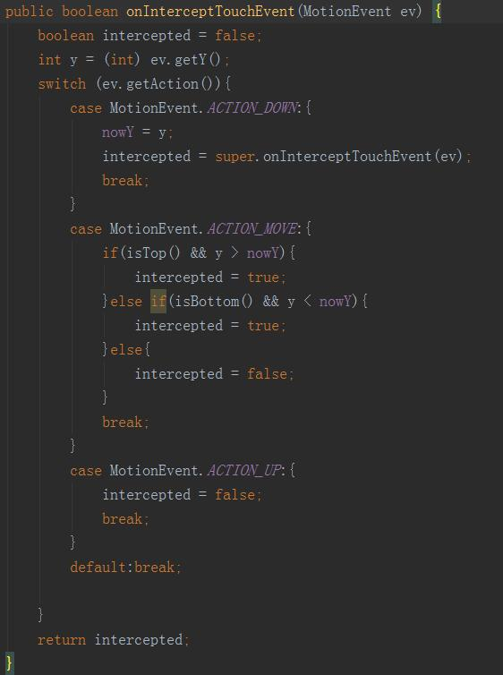

## ScrollView 嵌套 ListView 滑动冲突的解决方法 
>ScrollView 嵌套 ListView 或者嵌套ScrollView 是一种同方向的滑动冲突,当嵌套ListView时，如果不做任何处理，ListView的滑动会失效，只有ScrollView的滑动有效果。为了让ScrollView与ListView的滚动都能起到作用，这里有两种实现的方式。 
###自定义ScrollView
>自定义ScrollView是外部拦截，通过传递一个ListView，在onInterceptTouchEvent(MotionEvent ev)中做拦截处理，当ListView的第一条数据已经显示且是向下滑动或显示最后一条数据且向上滑动则ScrollView拦截事件，将滑动事件交由自己处理。其他则交给ListView处理。主要的方法如下： 
 
###自定义ListView
>自定义ListView是内部拦截，通过getParent().requestDisallowInterceptTouchEvent（）方法进行事件的拦截，思路与自定义ScrollView相似，在dispatchTouchEvent（MotionEvent ev）方法中进行设置，主要的方法如下： 
 
